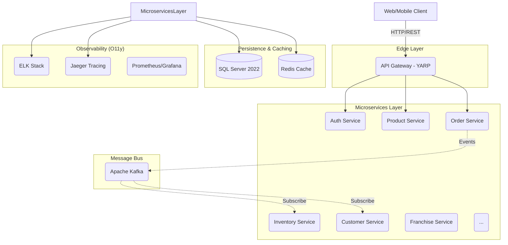

# Capital Franchise Supply Chain Management (CFMS)

[](https://github.com/vinhms/CapitalBistro)
[](https://dotnet.microsoft.com/download/dotnet/10.0)
[](https://www.docker.com/)
[](LICENSE)

**Capital Franchise Supply Chain Management (CFMS)** là một hệ thống kiến trúc Microservices hiện đại được thiết kế để quản lý chuỗi cung ứng và vận hành cho các chuỗi nhà hàng (Franchise). Hệ thống tích hợp các công nghệ tiên tiến nhất trong hệ sinh thái .NET, tập trung vào tính linh hoạt, khả năng mở rộng và độ tin cậy cao.

---

## 🏗 System Architecture

Hệ thống được xây dựng theo mô hình **Event-Driven Microservices** sử dụng **YARP Reverse Proxy** làm cổng vào duy nhất.



---

## 🚀 Tech Stack

- **Core**: .NET 10 (C# 13), Entity Framework Core
- **API Gateway**: YARP (Yet Another Reverse Proxy)
- **Communication**: 
    - **Sync**: gRPC & REST
    - **Async**: MassTransit + Apache Kafka
- **Caching**: Distributed Redis
- **Storage**: SQL Server 2022
- **Observability**: 
    - **Logging**: Serilog + Elasticsearch + Kibana (ELK)
    - **Tracing**: OpenTelemetry + Jaeger
    - **Monitoring**: .NET Health Checks + HealthChecksUI
- **DevOps**: Docker, Docker Compose, GitHub Actions (CI/CD)

---

## 🛠 Getting Started

### Prerequisites
- [Docker Desktop](https://www.docker.com/products/docker-desktop/)
- [.NET 10 SDK](https://dotnet.microsoft.com/download/dotnet/10.0)
- [Visual Studio 2022](https://visualstudio.microsoft.com/vs/) (Optional)

### Installation
1. Clone the repository:
   ```bash
   git clone https://github.com/vinhms/CapitalBistro.git
   cd CapitalBistro
   ```

2. Spin up the infrastructure and services:
   ```bash
   docker-compose up -d --build
   ```

3. Initialize Databases (Optional - Auto-migrated on startup):
   ```bash
   # Nếu cần chạy bằng tay
   dotnet ef database update --project src/Services/Order/CFMS.OrderService.Infrastructure
   ```

---

## 📑 Service Registry & Port Mapping

| Service | Port | Description |
| :--- | :--- | :--- |
| **API Gateway** | `8000` | Unified Entry Point (REST API) |
| **Swagger UI** | `8000/swagger` | Centralized API Documentation |
| **Health UI** | `8000/health-ui` | System Health Dashboard |
| **SQL Server** | `1433` | Primary Persistence Layer |
| **Redis** | `6379` | Distributed Cache |
| **Jaeger UI** | `16686` | Distributed Tracing UI |
| **Kibana** | `5601` | Log Visualization (ELK) |
| **Elasticsearch** | `9200` | Search & Logging Engine |
| **Kafka** | `9092` | Event Bus |

---

## 📖 Centralized API Documentation
Tất cả các dịch vụ được tích hợp vào một giao diện Swagger duy nhất. Truy cập tại:
👉 [http://localhost:8000/swagger](http://localhost:8000/swagger)

Sử dụng dropdown menu ở góc phải để chuyển đổi qua lại giữa các dịch vụ:
- `Auth API`
- `Order API`
- `Product API`
- ... và nhiều hơn thế nữa.

---

## 🔒 License
Hệ thống được phát hành dưới giấy phép **MIT License**.

> **Note**: Đây là một dự án Portfolio minh họa kiến trúc Microservices chuẩn Enterprise. Mọi thông tin cấu hình trong `docker-compose.yml` nên được thay đổi cho môi trường Production.
